# Email Bot Workflow - Alternative Approach (Swimlane & Sequence)

## Actor-Based Swimlane Workflow

```mermaid
graph TD
    subgraph "User/Sender"
        U1["📧 Send Email Request"]
    end
    
    subgraph "Outlook System"
        O1["Email Arrives in Inbox"]
        O2["Trigger Webhook"]
    end
    
    subgraph "Email Bot - Intake"
        B1["Receive Email Event"]
        B2["Extract Content & Metadata"]
        B3["Classify Request Type"]
    end
    
    subgraph "Email Bot - Intelligence"
        B4["Query Email Archive"]
        B5["Fetch Related Chains"]
        B6["Extract Patterns"]
        B7["Generate AI Suggestion"]
    end
    
    subgraph "Human Reviewer"
        H1["Review Suggestion"]
        H2["Approve/Modify/Escalate"]
    end
    
    subgraph "Email Bot - Execution"
        B8["Send Response"]
        B9["Log Transaction"]
    end
    
    subgraph "Analytics Engine"
        A1["Record Metrics"]
        A2["Update Dashboards"]
        A3["Generate Monthly Report"]
    end
    
    U1 --> O1
    O1 --> O2
    O2 --> B1
    B1 --> B2
    B2 --> B3
    B3 --> B4
    B4 --> B5
    B5 --> B6
    B6 --> B7
    B7 --> H1
    H1 --> H2
    H2 -->|Approved| B8
    H2 -->|Modified| B8
    H2 -->|Escalated| H1
    B8 --> B9
    B9 --> A1
    A1 --> A2
    A2 --> A3
```

## Sequence Diagram - Request to Response Flow

```mermaid
sequenceDiagram
    participant User as 👤 User
    participant Outlook as 📧 Outlook
    participant Bot as 🤖 Email Bot
    participant Archive as 📚 Email Archive
    participant AI as 🧠 AI Engine
    participant Reviewer as 👨‍💼 Human Reviewer
    participant Response as 📤 Response Handler

    User->>Outlook: Send Email Request
    Outlook->>Bot: Webhook Trigger
    Bot->>Bot: Parse Email
    Bot->>Bot: Classify Type
    
    Bot->>Archive: Query Related Emails
    Archive-->>Bot: Return Email Chain
    Bot->>Archive: Fetch Attachments
    Archive-->>Bot: Return Files
    
    Bot->>AI: Send Context + Request
    AI->>AI: Analyze Patterns
    AI->>AI: Check User Guides
    AI->>AI: Generate Suggestion
    AI-->>Bot: Return Suggested Response
    
    Bot->>Reviewer: Present Suggestion + Context
    Reviewer->>Reviewer: Review & Decide
    
    alt Approved
        Reviewer->>Response: Send Response
        Response->>Outlook: Post Reply
        Response->>Bot: Log Success
    else Modified
        Reviewer->>Response: Send Modified Response
        Response->>Outlook: Post Reply
        Response->>Bot: Log Modified
    else Escalated
        Reviewer->>Bot: Flag for Manual Review
        Bot->>Bot: Create Escalation Ticket
    end
    
    Bot->>Bot: Update Metrics
    Bot->>Bot: Record Response Time
```

## State Machine - Email Processing States

## Parallel Processing - Multi-Request Handling

## Decision Tree - Request Classification & Routing

```mermaid
graph TD
    A["New Email"] --> B{Analyze Content}
    
    B -->|Contains 'access'| C{Access Type?}
    C -->|New User| C1["Access Provisioning"]
    C -->|Existing User| C2["Access Modification"]
    
    B -->|Contains 'terminate'| D{Termination Type?}
    D -->|User Leaving| D1["User Termination"]
    D -->|Role Change| D2["Account Transfer"]
    
    B -->|Contains 'file'| E{File Operation?}
    E -->|Transfer| E1["File Transfer"]
    E -->|Share| E2["File Sharing"]
    
    B -->|Other| F["General Inquiry"]
    
    C1 --> G["Query Access History"]
    C2 --> G
    D1 --> G
    D2 --> G
    E1 --> G
    E2 --> G
    F --> G
    
    G --> H["Retrieve Related Emails"]
    H --> I["Extract Patterns"]
    I --> J["Generate Response"]
    J --> K["Human Review"]
```

## Data Flow - Information Movement

## Timeline - Request Lifecycle

## Request Type Matrix - Processing Path

## Performance Metrics - Monthly Dashboard

