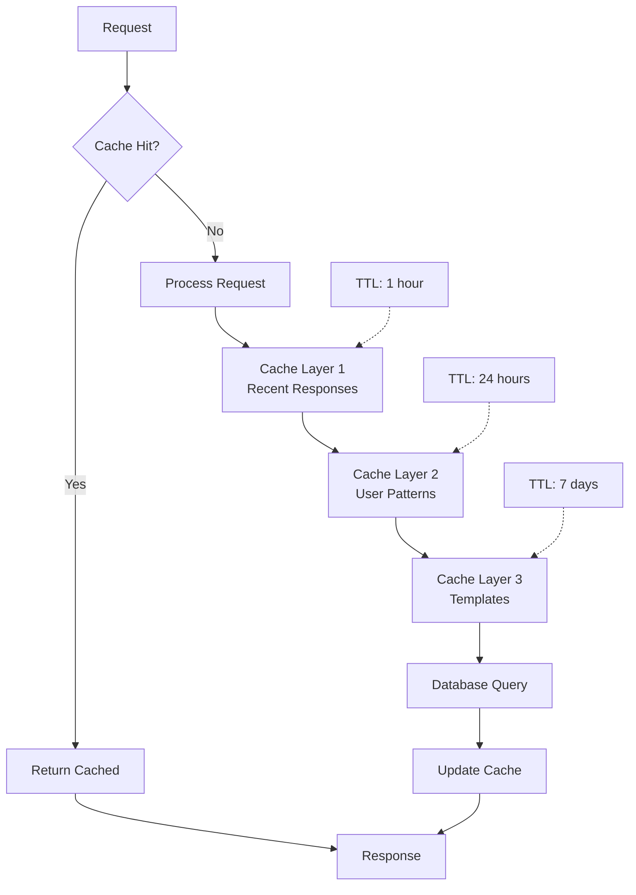

# Email Bot Workflow - Component & Integration Approach

## System Architecture - Component Interaction

```mermaid
graph TB
    subgraph "External Systems"
        O["🔵 Outlook/Exchange"]
        UG["📖 User Guides Repository"]
        DB["💾 Corporate Database"]
    end
    
    subgraph "Email Bot Core"
        IG["Ingestion Service"]
        CL["Classification Service"]
        AR["Archive Service"]
        AI["AI/ML Service"]
        RV["Review Service"]
        EX["Execution Service"]
    end
    
    subgraph "Data Layer"
        EDB["Email Database"]
        RDB["Response Database"]
        MDB["Metrics Database"]
        CB["Cache Layer"]
    end
    
    subgraph "Output Systems"
        UI["👨‍💼 Reviewer Dashboard"]
        RP["📊 Report Generator"]
        LOG["📝 Audit Log"]
    end
    
    O -->|Webhook| IG
    IG -->|Parse| CL
    CL -->|Classify| AR
    AR -->|Query| EDB
    EDB -->|Context| AI
    UG -->|Reference| AI
    DB -->|Lookup| AI
    AI -->|Suggestion| RV
    RV -->|Display| UI
    UI -->|Decision| EX
    EX -->|Send| O
    EX -->|Log| LOG
    LOG -->|Aggregate| MDB
    MDB -->|Generate| RP
    
    IG -.->|Cache| CB
    AR -.->|Cache| CB
    AI -.->|Cache| CB
    
    EX -->|Store| RDB
    RDB -->|Reference| AI
```

## Service Layer - Microservices Pattern

## Event-Driven Architecture

## Request Processing Pipeline

## Integration Points - External Systems

## Data Model - Entity Relationships

## Deployment Architecture

## Request Lifecycle - Detailed Stages

## Performance Optimization - Caching Strategy

## Monitoring & Observability

## Scalability Pattern - Horizontal Scaling

## Error Handling & Recovery

## Security & Compliance

